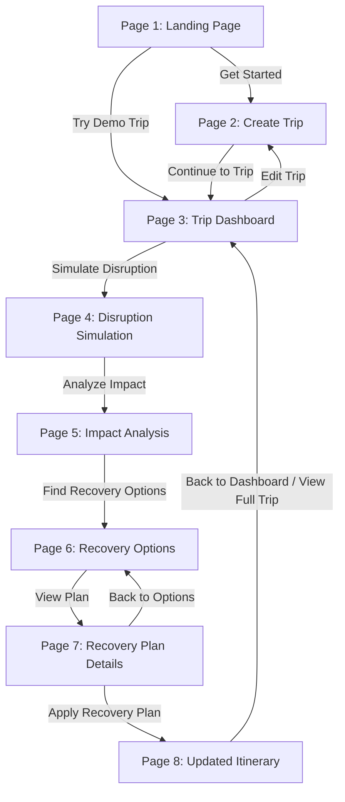

# 🧭 YatraSetu — TripRescue

> **"Your trip changes. Your plan adapts."**  
> A premium, trustworthy travel disruption recovery platform built for hackathon demonstration. When an itinerary component breaks, YatraSetu immediately calculates the downstream ripple effects and presents actionable recovery options.

🌐 **Live Deployment**: [https://yatrasetu-tau.vercel.app/](https://yatrasetu-tau.vercel.app/)

---

## ✨ Key Capabilities

- 🚨 **Real-Time Downstream Impact Mapping**: When a flight or segment slips, YatraSetu immediately traces downstream connections (transfers, hotel check-ins, scheduled activities) and flags affected bookings.
- ⏱️ **Interactive Dynamic Delay Simulation**: Supports preset delays (`+30m`, `+1h`, `+2h`, `+3h`, `+5h`) or custom hour/minute inputs with live recalculated touchdown and arrival buffers.
- 🎯 **Multi-Objective Recovery Plans**:
  - **Option 1 (Recommended)**: Preserves airfare, shifts chauffeur transfer, and moves morning activity.
  - **Option 2 (Lowest Cost)**: Preserves flight, re-dispatches transfer, and claims an instant refund credit for missed tours.
  - **Option 3 (Fastest)**: Rebooks to direct alternate flight, preserving transfer and activities without schedule slip.
- 🔄 **Stateful End-to-End Synchronization**: Applying a plan modifies central trip state in memory and `localStorage`, keeping the dashboard permanently updated.
- 📱 **Clean, Restrained Design**: Deep navy blue, crisp white surfaces, and status colors strictly reserved for operational health (Emerald for Confirmed/Safe, Amber for At Risk, Rose for Disrupted).

---

## 🚀 Core 8-Step Flow



1. **Page 1 — Landing Page**:
   - Official YatraSetu logo with preserved proportions.
   - Editorial headline: *"Your trip changes. Your plan adapts."*
   - Direct CTA: *"Try Demo Trip"* loads predefined Mumbai → Paris → Amsterdam trip instantly.
   - Connected travel itinerary hero visual: `Flight → Transfer → Hotel → Activity → Train`.
   - The Problem section: *"One change can affect the entire journey."* with interactive cascade toggle.
   - Three-step explanation: `01 Add your trip`, `02 Understand the impact`, `03 Choose a recovery plan`.

2. **Page 2 — Create Trip & Itinerary Builder**:
   - Set Trip Name, Destination, Start & End Dates with validation.
   - Add/Edit/Delete components: Flight, Hotel, Train, Transfer, Activity.
   - *"Continue to Trip"* loads custom itinerary into Dashboard.

3. **Page 3 — Trip Dashboard**:
   - Status badge: *"On Track"* (or *"Stable / Recovered"*).
   - Chronological timeline with type icons, dates, times, routes, status badges, and inline editing.
   - Sidebar summary: Total items, flights, hotels, trains, transfers, activities, and total trip cost.

4. **Page 4 — Disruption Simulation**:
   - Realistic event selection (Flight delayed, Flight cancelled, Train delayed, Hotel unavailable, Activity cancelled).
   - Interactive delay controls: Quick presets or custom hour/minute selector.
   - Live recalculation preview card showing original arrival vs new expected arrival.

5. **Page 5 — Impact Analysis**:
   - Visual dependency chain dynamically calculated based on delay:
     - `Flight` 🔴 Delayed
     - `Airport Transfer` 🔴 Pickup missed / 🟠 At risk
     - `Hotel` 🟠 Check-in delayed
     - `Activity` 🟠 At risk / severe turnaround conflict
     - `Train` 🟢 No impact (safe onward connection)
   - Summary of affected items and primary CTA: *"Find Recovery Options"*.

6. **Page 6 — Recovery Options**:
   - Differentiated plans comparison with standardized metric ordering:
     - **Option 1 (Recommended)**: *"Keep flight, Move airport transfer, Reschedule tour"*
     - **Option 2 (Lowest Cost)**: *"Keep flight, Cancel tour, Claim activity refund"*
     - **Option 3 (Fastest)**: *"Change flight, Keep transfer, Keep activity"*
   - Side-by-side comparison matrix with *"View Plan"* buttons.

7. **Page 7 — Recovery Plan Details**:
   - Exact Before $\rightarrow$ After comparison for each booking.
   - Summary statistics: Additional cost, bookings changed, bookings unchanged.
   - One-click *"Apply Recovery Plan"* with instant feedback.

8. **Page 8 — Updated Itinerary**:
   - Success state: *"Trip recovered. Your itinerary has been updated."*
   - Chronological recovered timeline with updated bookings visually distinguished.
   - Summary metrics: Trip Status *Stable*, bookings updated, bookings unchanged.
   - Returning to the Dashboard permanently reflects the recovered state.

---

## 🛠️ Tech Stack

- **Frontend**: React 19, TypeScript, Vite
- **Styling**: Tailwind CSS
- **Icons**: Lucide React
- **Hosting**: Vercel

---

## ⚙️ Getting Started

```bash
# 1. Clone the repository
git clone https://github.com/Aditya-More-CSE/yatrasetu.git

# 2. Enter directory
cd yatrasetu

# 3. Install dependencies
npm install

# 4. Start development server
npm run dev

# 5. Build for production
npm run build
```

---

## 🚀 Deployment to Vercel

The project is zero-config ready for Vercel:
- **Framework Preset**: Vite
- **Build Command**: `npm run build`
- **Output Directory**: `dist`
- **Live URL**: [https://yatrasetu-tau.vercel.app/](https://yatrasetu-tau.vercel.app/)

---

## 👥 Team YatraSetu

Built as a collaborative hackathon project focused on creating an actionable, trustworthy solution for travel disruption recovery.
